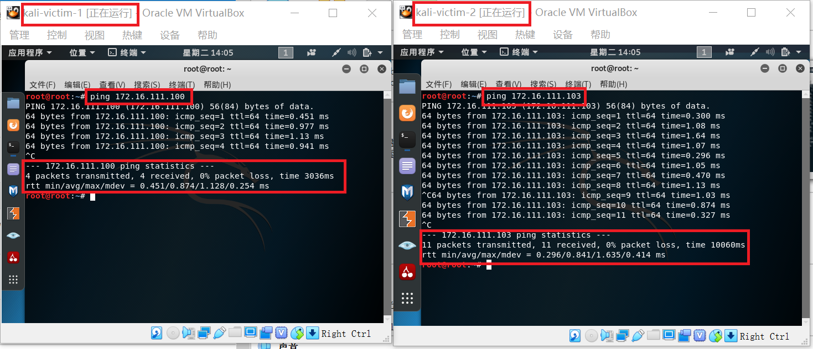

# 基于scapy编写扫描器

## 实验目的

* 掌握网络扫描之端口状态探测的基本原理

## 实验环境

* python + scapy

## 实验要求

* 禁止探测互联网上的 IP ，严格遵守网络安全相关法律法规
* 完成以下扫描技术的编程实现
  * TCP connect scan / TCP stealth scan
  * TCP Xmas scan / TCP fin scan / TCP null scan
  * UDP scan
* 上述每种扫描技术的实现测试均需要测试端口状态为：开放、关闭 和 过滤 状态时的程序执行结果
* 提供每一次扫描测试的抓包结果并分析与课本中的扫描方法原理是否相符？如果不同，试分析原因；
* 在实验报告中详细说明实验网络环境拓扑、被测试 IP 的端口状态是如何模拟的
* （可选）复刻 nmap 的上述扫描技术实现的命令行参数开关

## 实验过程

### 一、实验拓扑结构
----
1. kali-victim-1的网络设置

2. kali-victim-2的网络设置

3. 网关网络设置

4. 两台主机之间的连通性

5. 实验拓扑结构

### 二、实验过程

---

#### TCP connect scan

* 端口关闭状态的测试
  1. 查看此时处于开启状态的端口，其中没有80端口，说明此时80端口处于关闭状态
   
   2. 在kali1中开始抓包后，在kali2中运行TCP_connect_scan.py文件
   
   
   可以看到此时输出结果为closed

    3. 用wireshark打开刚才的抓包文件，可以看到kali2给kali1的80端口发送了含有SYN标志的TCP包，kali1主机给kali2主机发送了含有RST标志的包，端口处于关闭状态。
     
* 端口开启状态的测试
   1. 开启80端口
   
   2. 在kali1中开始抓包后，在kali2中运行TCP_connect_scan.py文件
   
   
   可以看到此时输出结果为open

    3. 用wireshark打开刚才的抓包文件，可以看到kali2给kali1发送了含有SYN标志的数据包，然后kali1给kali2发送了含有SYN标志的数据包，然后kali2给kali1发送了一个含有RST标志的数据包，和一个含有RST和ACK标志的数据包，他们完成了三次握手连接，且端口处于开启状态。
     
* 端口过滤状态的测试
   1. 将80端口设置为过滤状态
   
   2. 在kali1中开始抓包后，在kali2中运行TCP_connect_scan.py文件
   
   
   可以看到此时输出结果为filtered

    3. 用wireshark打开刚才的抓包文件,发现kali2主机给kali1主机的80端口发送了含有SYN的TCP包，但是kali1主机没有回复。端口处于过滤状态。
    

#### TCP stealth scan

* 端口关闭状态的测试
   1. 查看此时处于开启状态的端口，其中没有80端口，说明此时80端口处于关闭状态
   
   2. 在kali1中开始抓包后，在kali2中运行TCP_stealth_scan.py文件
   
  
   可以看到此时输出结果为closed

    3. 用wireshark打开刚才的抓包文件，可以看到kali2给kali1的80端口发送了设置SYN标志的TCP包，kali1给kali2发送了含有RST标志的包，端口处于关闭状态。
     
* 端口开启状态的测试
   1. 开启80端口
   
   2. 在kali1中开始抓包后，在kali2中运行TCP_stealth_scan.py文件
   

   可以看到此时输出结果为open

    3. 用wireshark打开刚才的抓包文件，可以看到kali2给kali1发送了含有SYN标志的数据包，然后kali1给kali2发送了含有SYN标志的数据包，然后kali2给kali1发送了两个个含有RST标志的数据包，他们完成了三次握手连接，且端口处于开启状态。
     
* 端口过滤状态的测试
   1. 将80端口设置为过滤状态
   
   2. 在kali1中开始抓包后，在kali2中运行TCP_stealth_scan.py文件
   
   可以看到此时输出结果为filtered

    3. 用wireshark打开刚才的抓包文件,发现kali2主机给kali1主机的80端口发送了含有SYN的TCP包，但是kali1主机没有回复，端口处于过滤状态。
    

#### TCP Xmas scan

* 端口关闭状态的测试
   1. 查看此时处于开启状态的端口，其中没有80端口，说明此时80端口处于关闭状态
   
   2. 在kali1中开始抓包后，在kali2中运行TCP_xmas_scan.py文件
   
  
   可以看到此时输出结果为closed

    3. 用wireshark打开刚才的抓包文件，可以看到kali2给kali1的80端口发送了含有PSH，FIN和URG标志的TCP包，kali给kali2主机发送了含有RST和ACK标志的包，端口处于关闭状态。
    
     

* 端口过滤状态的测试
   1. 将80端口设置为过滤状态
   
   2. 在kali1中开始抓包后，在kali2中运行TCP_xmas_scan.py文件
   
   可以看到此时输出结果为filtered

    3. 用wireshark打开刚才的抓包文件,发现kali2主机给kali1主机的80端口发送了含有FIN、PSH、URG标志的TCP包，但是kali1主机没有回复。端口处于过滤状态。
    

#### TCP fin scan

* 端口关闭状态的测试
   1. 查看此时处于开启状态的端口，其中没有80端口，说明此时80端口处于关闭状态
   
   2. 在kali1中开始抓包后，在kali2中运行TCP_fin_scan.py文件
   
  
   可以看到此时输出结果为closed

    3. 用wireshark打开刚才的抓包文件，可以看到kali2给kali1的80端口发送了设置FIN标志的TCP包，kali2给klai1主机发送了含有RST和ACK标志的包，端口处于关闭状态。
     

* 端口过滤状态的测试
   1. 将80端口设置为过滤状态
   
   2. 在kali1中开始抓包后，在kali2中运行TCP_fin_scan.py文件
   
   可以看到此时输出结果为filtered

    3. 用wireshark打开刚才的抓包文件,发现kali2主机给kali1主机的80端口发送了含有FIN的TCP包，但是kali1主机没有回复。端口处于过滤状态。
    

#### TCP null scan

* 端口关闭状态的测试
   1. 查看此时处于开启状态的端口，其中没有80端口，说明此时80端口处于关闭状态
   
   2. 在kali1中开始抓包后，在kali2中运行TCP_null_scan.py文件
   
  
   可以看到此时输出结果为closed

    3. 用wireshark打开刚才的抓包文件，可以看到kali2给kali1的80端口发送了没有设置标志的TCP包，kali2给klai1主机发送了含有RST和ACK标志的包，端口处于关闭状态。
     

* 端口过滤状态的测试
   1. 将80端口设置为过滤状态
   
   2. 在kali1中开始抓包后，在kali2中运行TCP_null_scan.py文件
   
   可以看到此时输出结果为filtered

    3. 用wireshark打开刚才的抓包文件,发现kali2主机给kali1主机的80端口发送了没有任何标志位的TCP包，但是kali1主机没有回复。端口处于过滤状态。
    

#### UDP scan

* 端口关闭状态的测试
   1. 查看此时处于开启状态的端口，其中没有80端口，说明此时80端口处于关闭状态
   
   2. 在kali1中开始抓包后，在kali2中运行UDP_scan.py文件
   
  
   可以看到此时输出结果为closed

    3. 用wireshark打开刚才的抓包文件，可以看到kali2给kali1的80端口发送了UDP包，kali1没有给出任何回复，端口处于关闭状态。
     
* 端口开启状态的测试
   1. 开启80端口
   
   2. 在kali1中开始抓包后，在kali2中运行UDP_scan.py文件
   

   可以看到此时输出结果为open

    3. 用wireshark打开刚才的抓包文件，可以看到kali2给kali1发送了UDP数据包，kali1给kali2发送了IPV4数据包，端口处于开启状态。
     

#### 复刻 nmap 的上述扫描技术实现的命令行参数开关
* TCP connect scan

    nmap 172.16.111.103 -p 80 -sT -n -T4 -vv 

* TCP stealth scan

    nmap 172.16.111.103 -p 80 -sS -n -T4 -vv 

* TCP Xmas scan

    nmap 172.16.111.103 -p 80 -sX -n -T4 -vv 

* TCP fin scan

    nmap 172.16.111.103 -p 80 -sF -n -T4 -vv 

* TCP null scan

    nmap 172.16.111.103 -p 80 -sN -n -T4 -vv 

* UDP scan

    nmap 172.16.111.103 -p 80 -sU -n -T4 -vv 

## 参考资料
* [port-scanning-using-scapy](https://resources.infosecinstitute.com/port-scanning-using-scapy/)
* [基于Scapy编写端口扫描器.md
](https://github.com/CUCCS/2019-NS-Public-DXY0411/blob/ns_chap0x05/ns_chap0x05/基于%20Scapy%20编写端口扫描器.md)
