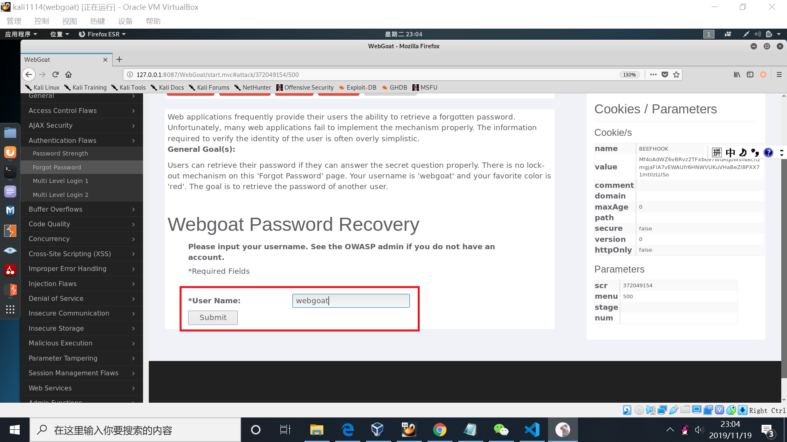
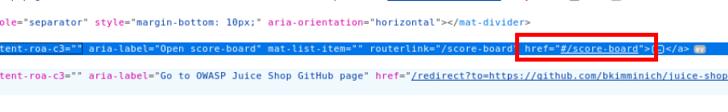

# Web 应用漏洞攻防

## 实验目的

* 了解常见 Web 漏洞训练平台；
* 了解 常见 Web 漏洞的基本原理；
* 掌握 OWASP Top 10 及常见 Web 高危漏洞的漏洞检测、漏洞利用和漏洞修复方法；

## 实验环境

* WebGoat
* Juice Shop

## 实验要求

* 每个实验环境完成不少于 5 种不同漏洞类型的漏洞利用练习；

## 实验过程

### （一）WebGoat环境下的漏洞攻防

* ### WebGoat环境搭建

1. 搭建webgoat环境，输入
  ```apt update && apt install docker-compose```

2. 新建目录tmp，将老师写好的文件git clone到该目录下

3. 输入```docker-compose up -d```启动这个环境，启动结束后利用命令```docker ps```查看，若容器都显示healthy，则表示环境启动成功 


4. 打开浏览器输入127.0.0.1:8087/WebGoat/attack进入登陆页面

输入用户名密码即可登陆


5. 下载SwitchyOmega插件，设置代理。我们把它命名为burpsuite。

因为我们只用一台虚拟机，是自己访问自己的容器环境的方式，所以注意要将Bypass List中的内容删除，否则在burpsuite中无法看到我们的请求。

6. 打开burpsuite，设置如下，它和刚才我们设置的代理是对应的。


* ### 未验证的用户输入漏洞

#### 一、绕过html字段限制

1. 未进行修改前，input字段只可以输入最多五个字符。我们用开发者工具查看网页源代码，并且将max length值修改为1234，可以看到我们的输入字符串的长度可以大于五个。


2. burpsuite设置为```intercept is on```,回到我们将要提交数据的界面，点击submit,可以看到burpsuite拦截到了我们提交的信息。


3. 在burpsuite中对拦截到的信息的字段进行修改，并且点击forward将其提交上去，成功实现了绕过html字段的限制。


#### 二、绕过客户端javascript校验

1. 在网页随意输入一些字符串，由于它的限制，会对我们提交的字符串进行检查，如果不符合要求就会报错。


2. 在burpsuite会看到刚才提交的数据


3. 用开发者工具打开网页源码，找到判断字符串是否合法的代码段将其删除

4. 在burpsuite输入不合法字符串并且点击forward,成功实现绕过客户端javascript校验


* ### XSS跨站脚本攻击

1. 登录用户名Tom Cat（employee），密码为tom。选中Tom Cat，点击“ViewProfile”按钮。
2. 在地址栏中，输入攻击语句```<script>alert('hacked')< /script>```

3. 点击“UpdateProfile”按钮，并登出系统。此时的页面效果：

4. 以用户 David，密码 david 登录，然后浏览 Bruce 的信息，即可完成。

5. 以用户名 Larry，密码 larry 登录。点击“SearchStaff”，在搜索框中，添加如下一段代码 ```<script>alert('dangerous')</ script>```

6.点击“FindProfile”按钮，此时的页面效果：


* ### 脆弱的访问控制

1. 如果能正确回答密码提示问题，那么就可以找回密码。“忘记密码”页面未设定任何锁定策略。输入自己的信息，可以获取到自己的密码


2.以admin用户为例，试着猜测密码保护问题的答案，以获取admin的密码。在user name处输入admin，提交后出现密码保护问题，任意输入各种颜色的名称，多次尝试后发现green为正确答案。出现提示后，表示攻击成功，得到了密码


* ### 脆弱认证和会话管理

1. 在邮件正文的链接中中加入Session ID，即加入&SID=WHATEVER


2. 点击确认提交后，第一步完成。现在我们是第一步中的收件人Jane。点击弹出页面中的链接“Goat Hills Financial”


3. 以用户名Jane，密码tarzan登陆


4. 回车后登陆成功


5. 现在我是黑客Joe,点击链接登录到“Goat Hills Financial”页面。我们可以看到浏览器网址中我们的SID是“NOVALIDSESSION”


6. 将SID修改为我们在第一步的邮件中填入的“WHATEVER”，回车后成功


* ### 注⼊缺陷

1. 在网页中随意输入密码，并用burpsuite拦截


2. 将拦截下的密码修改为``` ' or '1'='1```，并点击forward


3. 实现绕过密码登陆


### （二）Juice Shop环境下的漏洞攻防

* ### Juice shop环境搭建

1. 切换到juiceshop目录下，输入```docker-compose up -d```启动这个环境，启动结束后利用命令```docker ps```查看，若容器都显示healthy，则表示环境启动成功


2. 我们可以看到juice shop端口号为3000，输入```127.0.0.1：3000/```访问juice shop首页，并进行新用户的注册

3. 在源代码中搜索查找计分板


4. 访问对应网址，寻找计分板成功


* ### sql注入

  **实验要求：使用管理员的用户帐户登录** 

1. 在登陆页面的用户名按照webgoat中的方法输入```'or '1'='1```，密码随意填写，发现无效


2. 在用户名部分输入```'or 1=1--```，密码随意填写。


3. 回车后成功实现绕过密码登陆


* ### 脆弱认证

  **实验要求：通过“忘记密码”机制重置Bjoern的OWASP帐户的密码，并真实回答其安全问题。** 

1. 输入Bjoern的owasp账户，密保问题是问最喜欢的宠物，这与qq找回密码的机制类似


2. 通过互联网信息搜索，发现他有一只猫叫'Zaya'，尝试填入答案，并进行密码重置
3. 回车后成功实现密码重置


* ### XSS

  **实验要求：利用```<iframe src="javascript:alert(`xss`)">```语句实现DOM型XSS攻击**

1. 按照题目要求在搜索栏中输入```<iframe src="javascript:alert(`xss`)">```，出现弹窗


2. 实验完成


* ### 敏感数据曝光

  **实验要求：获取机密文件**

1. 浏览关于我们网页，发现里有个很明显的链接，点击发现是下载，访问该下载路径（左下角可以看到下载路径），可以发现一些机密文件。


2. 根据左下角的路径访问ftp链接

3. 点开文件可以看到这是一个机密文件内容，实现了获取


* ### 脆弱的访问控制

  **实验要求：查看另一个用户的购物车**

1. burpsuite设置为intercept is on，然后点击我的购物车，在burpsuite中可以看到我们抓到的包,第一行为```GET /rest/basket/5 HTTP/1.1```


2. 将basket后的5改为6，点击forward


3. 成功完成访问别人的购物车的实验


## 实验遇到的问题

1. 在burpsuite设置Proxy Listeners时，一直无法勾选，查资料后发现是端口号被占用，更换端口号就可以成功。

2. 3000端口号只是用来访问juice shop的网页，burpsuite的端口号和浏览器代理设置的端口号要保持一致，但不需要设置成3000（设置3000会冲突，因为3000被占用了，无法勾选），3000是我们的目的地，而burpsuite相当于只是一个中间人。

3. 由于我们只有一台虚拟机进行实验，访问的是我们本机的127.0.0.1的地址。浏览器代理中的bypass list中的信息必须删除，否则无法成功访问。

## 参考资料

* [WebGoat中文手册](https://wenku.baidu.com/view/0d9de30e905f804d2b160b4e767f5acfa1c783d7.html?pn=1)
* [juice-shop官方教程](https://bkimminich.gitbooks.io/pwning-owasp-juice-shop/content/)