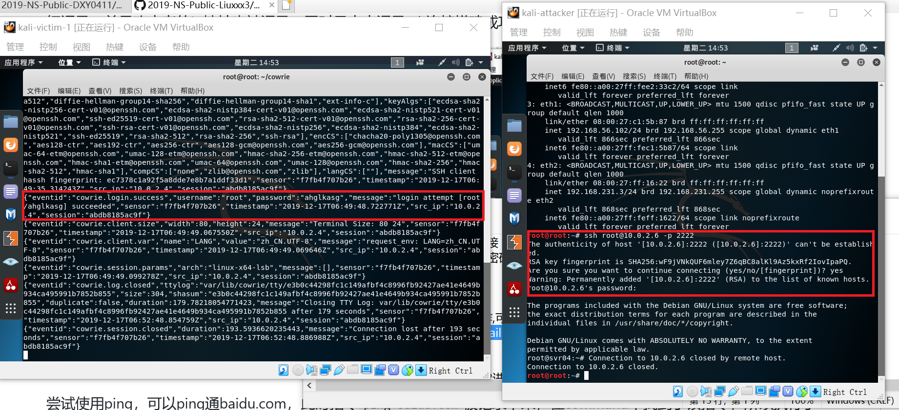

# 常见蜜罐体验和探索

## 实验目的

* 了解蜜罐的分类和基本原理
* 了解不同类型蜜罐的适用场合
* 掌握常见蜜罐的搭建和使用

## 实验环境

* 从 paralax/awesome-honeypots 中选择 1 种低交互蜜罐和 1 种中等交互蜜罐进行搭建实验
    * 推荐 SSH 蜜罐
* 靶机：kali-victim-1
  攻击者主机：kali-attacker


## 实验要求

* 记录蜜罐的详细搭建过程；
* 使用 nmap 扫描搭建好的蜜罐并分析扫描结果，同时分析「 nmap 扫描期间」蜜罐上记录得到的信息；
* 如何辨别当前目标是一个「蜜罐」？以自己搭建的蜜罐为例进行说明；
* （可选）总结常见的蜜罐识别和检测方法；
* （可选）基于 canarytokens 搭建蜜信实验环境进行自由探索型实验；

## 实验过程

### 一、蜜罐的搭建

* ssh_honeypot搭建

   1. 根据课本中给出的参考资料将ssh_honeypot 克隆到本地。
   
   2. 修改端口号，将端口改为56
        ```bash
        vi /etc/ssh/sshd_config
        ```
        
   3. 重启ssh并安装docker

        ```bash
        service ssh restart
        apt-get install docker docker-compose
        ``` 
        
   4. 按照参考文档中给出的步骤进行蜜罐搭建
   依次输入

        ``` apt install libssh-dev libjson-c-dev``` 

        

        ```bash
        make
        ssh-keygen -t rsa -f ./ssh-honeypot.rsa
        bin/ssh-honeypot -r ./ssh-honeypot.rsa
        ```
        
        
     * 一开始一直报错"bash: bin/ssh-honeypot: 没有那个文件或目录"，后来发现是没有输入make命令。查资料后发现make命令的作用是进行编译

* cowrie搭建
   1. 根据课本给出的参考地址将cowrie克隆到本地
    
   2. 安装镜像
     ```docker pull cowrie/cowrie```
     
   3. 运行cowrie
     ```docker run -p 2222:2222 cowrie/cowrie```
      

### 二、蜜罐测试

* ssh-honey
    * 攻击者主机尝试连接靶机，发现无论如何都无法连接靶机
    
     
* cowrie
    1. 攻击者主机尝试连接靶机，无论密码输入什么内容都可以成功登陆，同时在靶机的日志文件中可以看到攻击者主机的操作，登陆时输入的密码什么的都可以被记录下来。
    
    * 一段时间后蜜罐连接会自行断开
    * 输入```docker exec -it trusting_franklin tail -F /cowrie/cowrie-git/var/log/cowrie/cowrie.json```可以看到日志文件。
    * 靶机的蜜罐是跑在docker容器中，容器名字通过命令```docker ps```可以看到是trusting_franklin

      
    * 有时候攻击者主机连接靶机时会报错，"WARNING: REMOTE HOST IDENTIFICATION HAS CHANGED!"，此时输入```rm -rf ~/.ssh/known_hosts```后再次进行连接即可。
    2. 成功连接后，攻击者主机输入命令```curl www.baidu.com```，发现会报一个python语法错误，这也暴露了是一个蜜罐
        

    3. 输入命令```wget http://www.baidu.com/404.html```下载一个恶意文件，靶机的日志文件中会显示下载文件的地址。
    

    * 在靶机中进入日志中显示的文件的地址，可以看到刚才下载的文件
    
    4. cowrie其实是一个python程序，用python解释器执行的一个程序，其中twistd是他的主入口程序
    
    

### 三、nmap扫描
* ssh-honey
    1. Tcp connect
    端口为开启状态
    
    2. TCP stealth scan
    端口为开启状态
    
    3. XMAS scan
    端口为开启或过滤状态
    
    4. FIN scan
    端口为开启或过滤状态
    
    5. NULL scan
    端口为开启或过滤状态
    
    * 蜜罐日志中均无攻击者主机扫描端口操作的记录
* cowrie
    1. Tcp connect
    端口为开启状态
    
    2. TCP stealth scan
    端口为开启状态
    
    3. XMAS scan
    端口为开启或过滤状态
    
    4. FIN scan
    端口为开启或过滤状态
    
    5. NULL scan
    端口为开启或过滤状态
    
    * 仅在TCP stealth scan时蜜罐日志进行了记录

### 四、问题回答

**Q1.如何辨别当前目标是一个「蜜罐」？以自己搭建的蜜罐为例进行说明**
   * 当我们输入命令```curl www.baidu.com```的时候，会输出一个python中的报错，这就说明很有可能是一个python的蜜罐。同时，如果不管输入什么密码都可以进行ssh连接，则有可能是python程序模拟的假的ssh服务

**Q2.总结常见的蜜罐识别和检测方法**
   * 对低交互性蜜罐的识别。

      * 基于Fake proxies的识别技术。该技术典型应用在send2safe公司设计的反蜜罐软件Honeypot Hunter，该软件在25端口开一个虚假的邮件服务，要求每个openrelays向它反向连接，如果某个open relays只有连接成功会话而没有后继会话，就会使该软件产生响应，攻击者以此来判断目标系统很可能就是蜜罐。
      * 面向Tarpits的识别技术。在OSI/ISO参考模型第七层的Tarpits,仅仅需要看服务的延迟，攻击者就可以在多次尝试后发现目标系统是个假系统。对于第四层的Tarpits和LaBrea，TCP窗口减小为0，并且Tarpits继续接收新的数据包，这种现象会提醒攻击者目标系统很可能是蜜罐。
    * 对高交互性蜜罐的识别

      * 高交互蜜罐主要采用虚拟主机进行部署，虚拟机探测技术也就相应地成为攻击者最常用到的蜜罐识别方法，虚拟机探测的目标就是要检查当前代码是否正运行在一台虚拟的主机上。
      * 识别Honey wall。作为蜜网与其他网络的唯一连接点，所有流入、流出蜜网的网络流量都将通过 Honey wall。由于Honey wall的存在，出境的通信将被严格限制，比如每天只允许15个出境TCP连接。只需要启动大量的出境连接，然后观察如果在一定数量的连接之后连接是否受到了阻止，即可判断Honey wall的存在。

### 五、参考文献

* [paralax/awesome-honeypots](https://github.com/paralax/awesome-honeypots)

* [常见蜜罐体验和探索](https://github.com/CUCCS/2019-NS-Public-DXY0411/blob/ns_chap0x11/ns_chap0x11/常见蜜罐体验和探索.md)

* [基于蜜罐特征的蜜罐识别技术](https://www.docin.com/p-1517346225.html)

